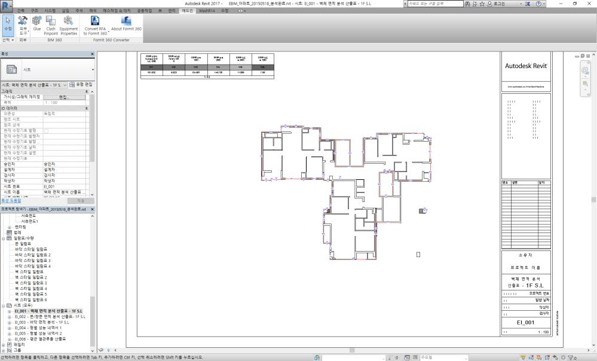
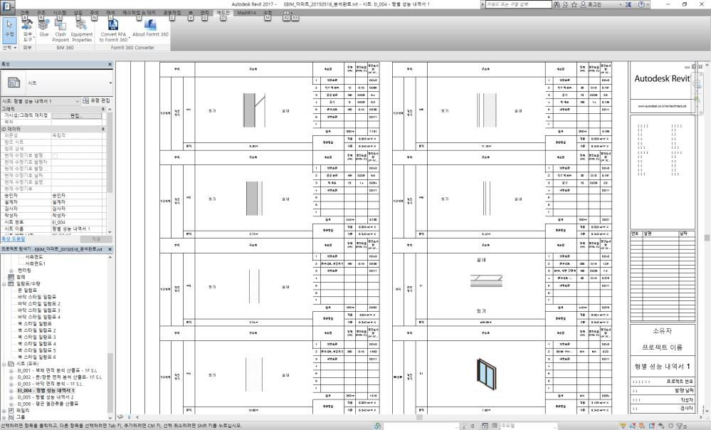

# Revit API 기반 BIM 에너지 성능 및 열관류율(U-Value) 자동 계산기

BIM 모델의 데이터를 직접 활용해 건물 에너지 성능 데이터의 추출과 분석을 자동화함으로써, 열성능 보고 작업에서 발생하던 수작업 산출과 계산 오류를 제거하는 커스텀 Autodesk Revit 애드인입니다.

## 개요

이 툴은 **Revit API**를 통해 Revit의 실시간 모델 데이터에 직접 연결되어 외벽, 개구부, 바닥의 재료를 식별하고 분석합니다. 복합 건축 부위의 열전도율을 자동으로 계산하고, 제출 가능한 형태의 에너지 성능 인증서와 열관류율(**U-value**) 보고서를 생성합니다. 기존에는 수 시간의 수작업 실측과 스프레드시트 작업이 필요했던 프로세스를 단일 자동화 워크플로로 전환한 것입니다.

**비즈니스 가치:** 더 빠르고 정확한 에너지 인증 문서 작성, 수작업 데이터 입력 감소, 건축 프로젝트 전반에서 일관되고 감사에 대응 가능한 열성능 보고서 확보.

## 미리보기

*Revit 모델에서 직접 추출한, 자동 생성된 벽체 면적 분석 시트로 인증 제출에 바로 사용할 수 있습니다.*

*각 건축 부위의 복합 재료 레이어, 두께, 산출된 U-value를 상세히 기재한 자동 생성 열성능 일람표입니다.*

## 주요 기능 및 문제 해결

- **BIM 데이터 자동 추출** — Revit API를 통해 실시간 Revit 모델에서 외벽, 개구부, 바닥 데이터를 직접 읽어와 수작업 실측이나 재입력의 필요성을 제거합니다.
- **복합 재료 분석** — 다층 구조의 벽체, 바닥, 개구부 부위를 식별하고 각 복합 재료의 열전도율을 체계적으로 계산합니다.
- **U-value 자동 계산** — 표준 산정 방식에 따라 분석 대상 건축 부위별 열관류율(U-value)을 산출합니다.
- **보고서 및 시트 자동 생성** — 완전한 에너지 성능 인증서와 U-value 일람표를 네이티브 Revit 시트 형태로 서식까지 갖춰 제출 가능한 상태로 생성합니다.
- **정확성 및 효율성 향상** — 수작업 데이터 입력 부담을 크게 줄이는 동시에 프로젝트 전반에서 매우 정확하고 재현 가능한 환경 데이터 분석을 보장합니다.

## 기술 스택

- C#
- .NET Framework
- Autodesk Revit API

## 역할

리드 개발자 — 전체 소프트웨어 아키텍처 설계, 개발, 구현을 총괄.
