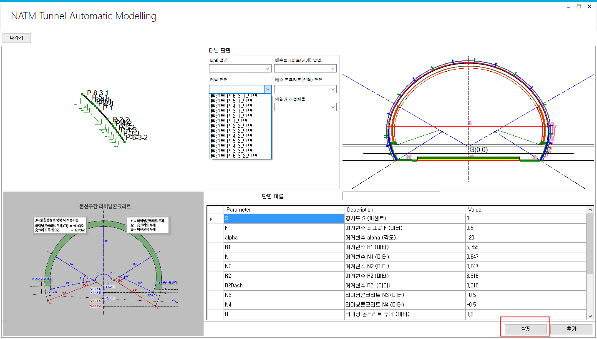
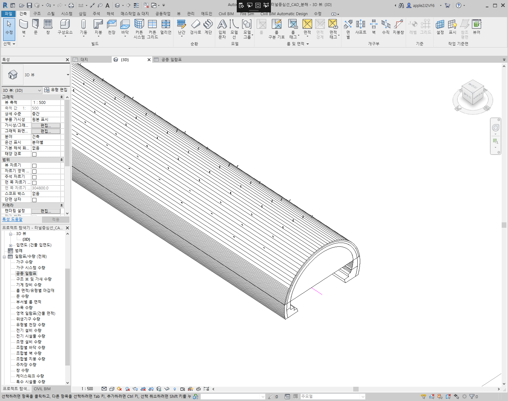

# Revit 플러그인 기반 터널 설계 및 물량 산출 자동화

간단한 수치 입력만으로 터널 지오메트리와 물량 산출표를 자동 생성하여, 수작업 터널 모델링을 빠르고 파라메트릭하며 GUI 기반인 워크플로로 대체하는 커스텀 Autodesk Revit 플러그인입니다.

## 개요

토목/인프라 팀은 통상적으로 터널 단면과 지오메트리를 수작업으로 모델링한 뒤, 자재 물량을 별도로 계산하는 데 상당한 시간을 소비합니다. 이 플러그인은 그 간극을 해소합니다. 사용자가 커스텀 GUI를 통해 수치값과 속성을 입력하면, 도구가 Revit 내부에 해당하는 터널 지오메트리를 자동으로 구성하고 완전한 물량 산출표를 하나의 연속적이고 반복 가능한 프로세스로 생성합니다.

**비즈니스 가치:** 터널 설계 반복 작업의 획기적인 속도 향상, 수작업 모델링 및 물량 산출 오류 제거, 견적 및 설계 검토를 위한 일관되고 표준화된 산출물 확보.

## 미리보기

▶️ **[데모 영상 보기](./ojbtyylci39y4wkrh4rj.mp4)** — 커스텀 GUI를 통해 터널 파라미터를 입력하고 Revit에서 결과 터널 지오메트리와 물량 산출표를 생성하는 과정입니다.

*(GitHub은 Markdown 내에서 동영상 파일을 인라인으로 미리보기하지 못합니다 — 위 링크를 클릭한 뒤 "View raw" / 다운로드로 재생하세요.)*

## 주요 기능 및 문제 해결

- **파라메트릭 GUI 입력** — 사용자는 별도의 CAD 수작업 모델링 없이, 전용 인터페이스를 통해 터널 속성과 수치값을 정의합니다.
- **지오메트리 자동 생성** — 플러그인이 입력된 파라미터를 바탕으로 Revit 내부에 정확한 터널 지오메트리를 프로그래밍적으로 구성합니다.
- **물량 산출표 자동 생성** — 생성된 지오메트리와 함께 견적에 바로 활용 가능한 완전한 자재/물량 산출표를 생성합니다.
- **설계 반복 속도 향상** — 입력 파라미터를 변경하면 지오메트리와 물량이 즉시 재생성되어 빠른 설계안 비교가 가능합니다.
- **오류 감소** — 전통적인 터널 물량 산출 과정에서 사람의 실수가 발생하기 쉬운 수작업 실측 및 계산 단계를 제거합니다.

## 기술 스택

- C#
- .NET Framework
- Autodesk Revit API

## 역할

메인 프로그래머.
