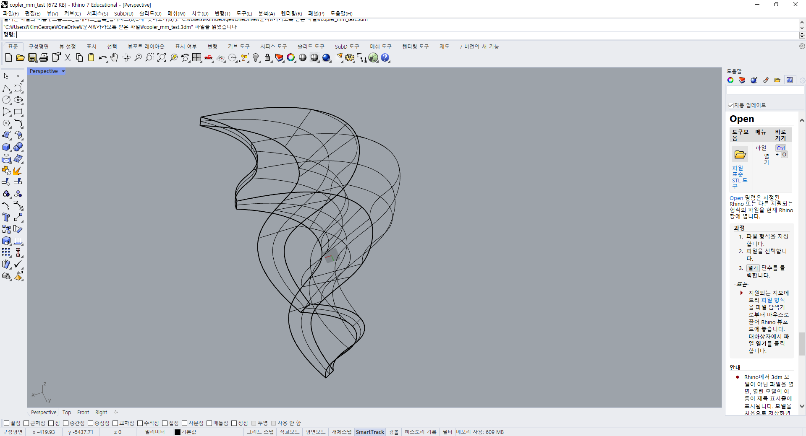
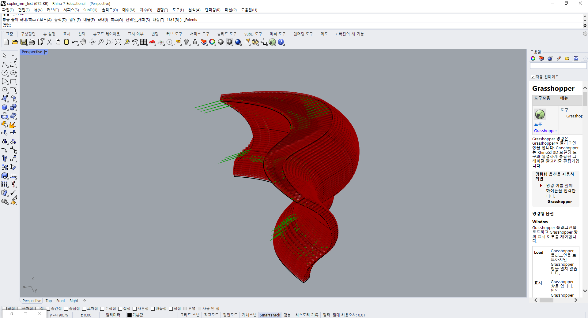
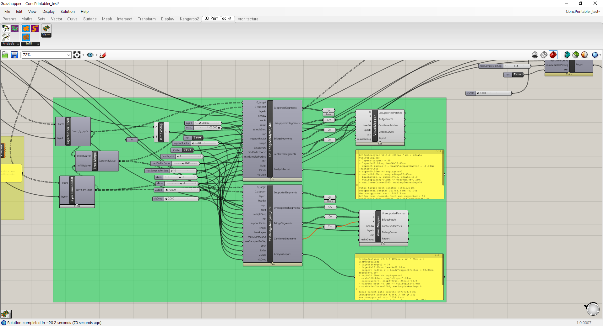
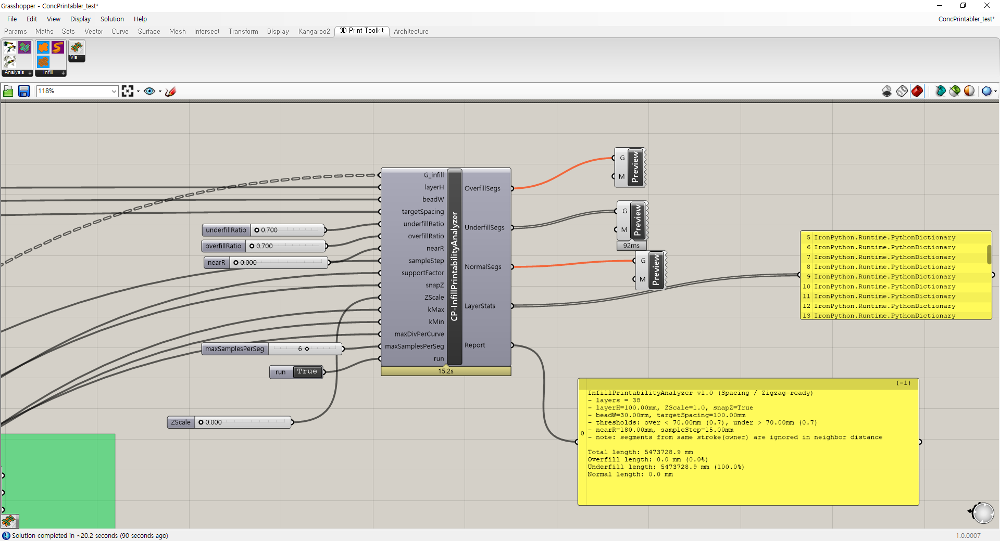

# Concrete 3D Printing Optimization & Analysis Tool in Rhino

A custom Grasshopper plugin suite for Rhino 7 that analyzes and optimizes the 3D printability of irregular concrete masses, validating structural viability before a single layer is physically printed.

## Overview

Commissioned for a university architectural research project, this suite of 10+ C# .NET Grasshopper modules automates the complex internal infill geometry required for concrete 3D printing of freeform architectural forms. It generates optimized, multi-core-parallelized zigzag toolpaths, converts them into 3D mesh "print bead" ribbons, and analyzes the result for print-quality issues — letting researchers catch structural and material problems in software instead of on the printer.

**Business value:** faster iteration on complex printable geometry, reduced material waste and failed prints, and quantitative, color-coded validation of print quality prior to fabrication.

## Preview

*Base freeform architectural geometry analyzed for 3D printability.*

*Auto-generated 3D mesh ribbons representing individual print beads, following calculated infill toolpaths.*

## Media Gallery

| Bridge & Support Analyzer (Grasshopper) | Infill Printability Analyzer |
|---|---|
|  |  |
| Custom `BridgeAnalyzer` component evaluating supported, unsupported, bridge, and cantilever segments across print layers. | Custom `InfillPrintabilityAnalyzer` component reporting overfill/underfill percentages and total toolpath length per layer. |

## Key Features & Problem Solving

- **Custom Grasshopper Plugin Suite** — 10+ purpose-built C# .NET modules extending Rhino 7 / Grasshopper for concrete additive manufacturing workflows.
- **Automated Infill Geometry Generation** — computes calculated area offsets and generates internal infill geometry for irregular, non-standard architectural masses.
- **Multi-Core Optimized Toolpath Routing** — implements parallelized (`Parallel.For`) zigzag routing algorithms for efficient, print-ready path generation.
- **3D Print Bead Simulation** — converts routed paths into 3D mesh ribbons that accurately represent the physical extruded print beads.
- **Overfill/Underfill Analysis** — an advanced analyzer visualizes overfill and underfill zones via color-coded maps, with quantitative reports on unsupported, bridge, cantilever, and normal segments per layer.
- **Structural Viability Validation** — surfaces print-quality and support issues before physical printing, reducing wasted material and failed print runs.

## Tech Stack

- C#
- .NET Framework
- Rhinoceros 3D / Grasshopper

## Role

Solo C# Plugin Developer / Computational Designer.
