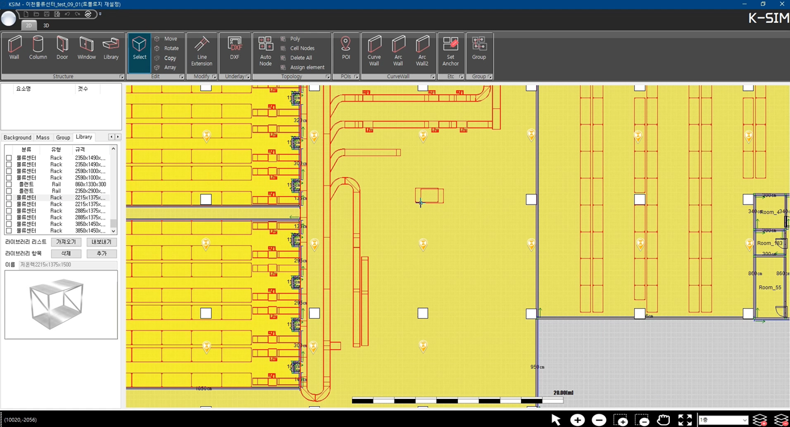
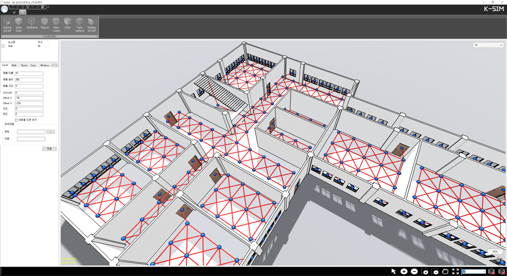
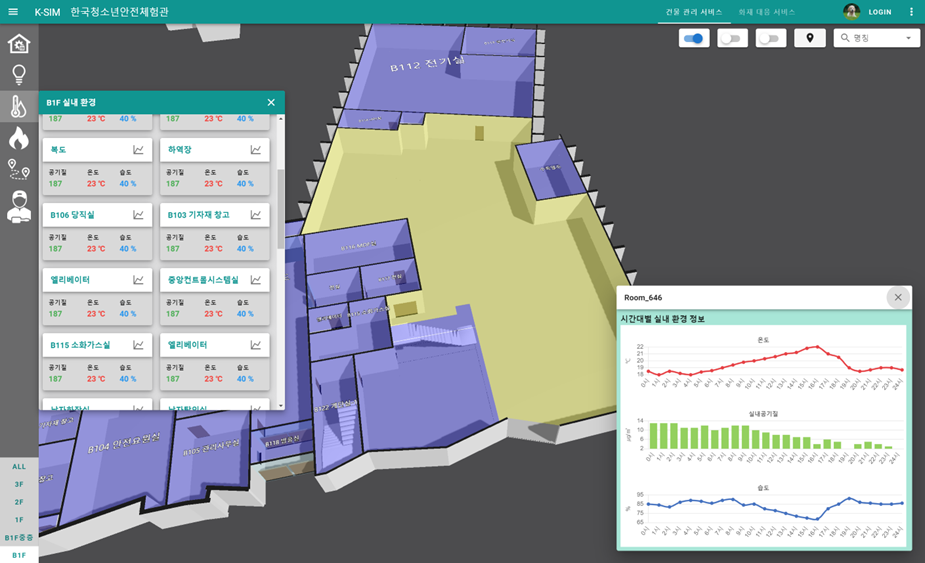

# Development of a Spatial Authoring CAD Program

A specialized spatial data authoring tool built from scratch that bridges the gap between complex CAD environments and end-users, letting non-experts create production-ready 3D spatial data for control and monitoring systems without any professional 3D modeling skills.

## Overview

Facilities and building operators need accurate 3D spatial data to power monitoring dashboards and digital twins, but producing that data traditionally requires dedicated CAD/BIM expertise. This project delivers a full desktop CAD authoring application — engine and UI built in-house — that lets end-users draw, structure, and export 3D spatial environments directly, which then feed downstream 3D control and monitoring systems.

**Business value:** removes the dependency on professional 3D modelers for facility data authoring, shortens the path from floor plan to live monitoring dashboard, and standardizes spatial data output for downstream systems.

## Preview

*Custom CAD engine: 2D floor plan authoring with wall/topology tools and a drag-and-drop equipment/rack library.*

## Media Gallery

| 3D Spatial Topology View | Live 3D Monitoring Dashboard |
|---|---|
|  |  |
| Authored spatial data rendered as a 3D model with cell-space topology and node connectivity overlaid. | The same spatial data consumed by a live monitoring dashboard, displaying real-time room environment data (temperature, air quality, humidity). |

## Key Features & Problem Solving

- **Full-Stack CAD Engine, Built From Scratch** — custom rendering/editing engine and UI covering both 2D floor-plan authoring and 3D visualization, with no reliance on third-party CAD SDKs.
- **No-Expertise Spatial Authoring** — purpose-built drawing tools (wall, column, door, window, curve wall) and topology tools (POI, cell nodes, auto node, assign element) let non-CAD-experts produce structured spatial data.
- **Asset/Equipment Library System** — drag-and-drop library of parametric equipment (e.g., racks, rails) with save/import/export of custom library items for reuse across projects.
- **2D-to-3D Spatial Topology Generation** — automatically derives 3D cell-space topology and node-network connectivity from the authored 2D floor plan.
- **Production-Ready Data Export** — outputs spatial data directly consumable by downstream 3D control and monitoring systems, closing the loop from authoring to live dashboard.
- **End-to-End Validation** — the same authored spatial model powers a live web-based monitoring dashboard with real-time environmental data per room, proving the data pipeline works end-to-end.

## Tech Stack

- C#
- .NET Framework
- Unity
- CAD Software
- Desktop Application

## Role

Solo Full-Stack CAD Developer (Engine/UI).
