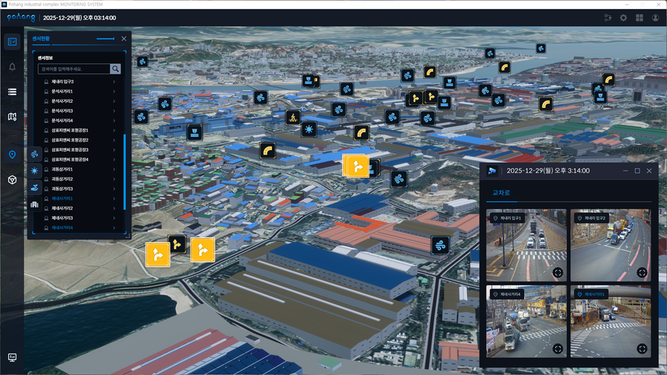
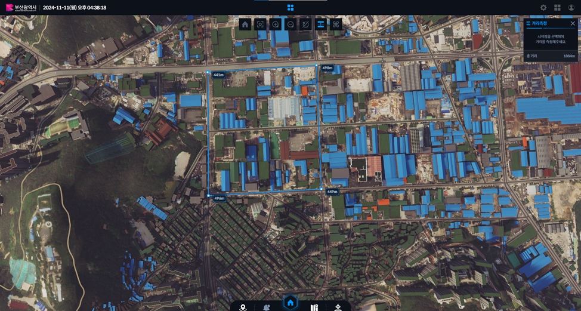

# Industrial Complex Air Quality & Pollutant Monitoring 3D Dashboard in Unity

A Unity-based 3D dashboard for monitoring air quality and pollutant emissions across industrial complexes, rendering entire complexes as interactive 3D city models with on-site sensors and CCTV feeds overlaid on the map. Large-area rendering and LOD processing keep the scene fast and memory-efficient on standard Windows PCs.

## Overview

Industrial complexes cover wide areas packed with factories, roads, and residential edges, and air quality and pollution sensors are scattered across all of them. Reading that data from tables or 2D maps makes it hard to see *where* a problem is and what surrounds it. This project places the whole complex in a single 3D view:

1. **3D complex model** — aerial imagery and 3D building models of the industrial complex and surrounding area, navigable like a map.
2. **Sensor & CCTV overlay** — monitoring points (air quality, weather, traffic, factory sensors) are shown as icons at their real locations, with a searchable sensor list and live CCTV views of key intersections and entrances.
3. **Large-area performance** — wide-area rendering with LOD (level of detail) processing so the full complex stays responsive while using less memory.

**Business value:** operators can monitor air quality and pollution sources across an entire industrial complex from one 3D screen, quickly locating a sensor or incident in its real surroundings instead of cross-referencing separate systems.

## Preview

## Key Features

- **3D Industrial Complex Map** — aerial imagery with 3D building models of the complex, with home, zoom, and view controls.
- **Sensor Status Panel** — searchable list of monitoring points (entrances, intersections, factories); selecting a sensor locates it in the 3D scene.
- **Map Sensor Icons** — air quality, weather, and traffic monitoring points displayed as icons at their real positions.
- **CCTV Monitoring** — multi-view panel streaming CCTV at intersections and complex entrances.
- **Measurement Tools** — distance measurement drawn directly on the map with per-segment and total length.
- **Large-Area Rendering & LOD** — level-of-detail processing across the wide complex area for faster rendering and reduced memory use.
- **Multi-Site Deployment** — deployed for multiple industrial complexes (e.g. Busan, Pohang).

## Tech Stack

- C#
- Unity3D
- Windows 10 / Windows 11
