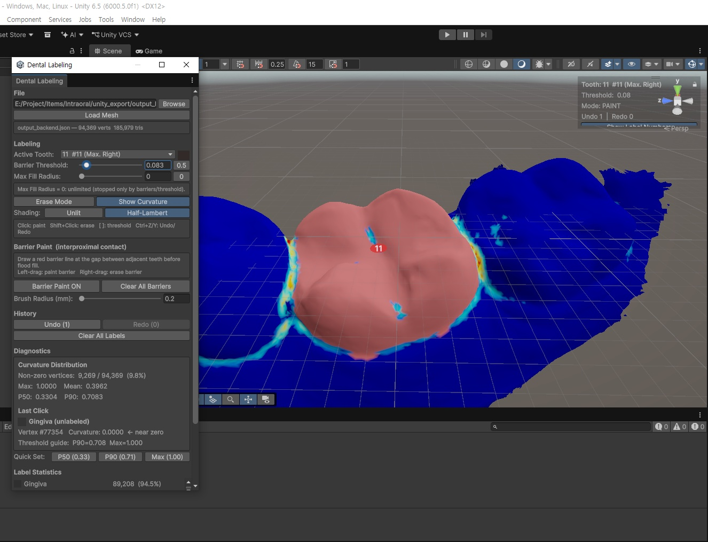
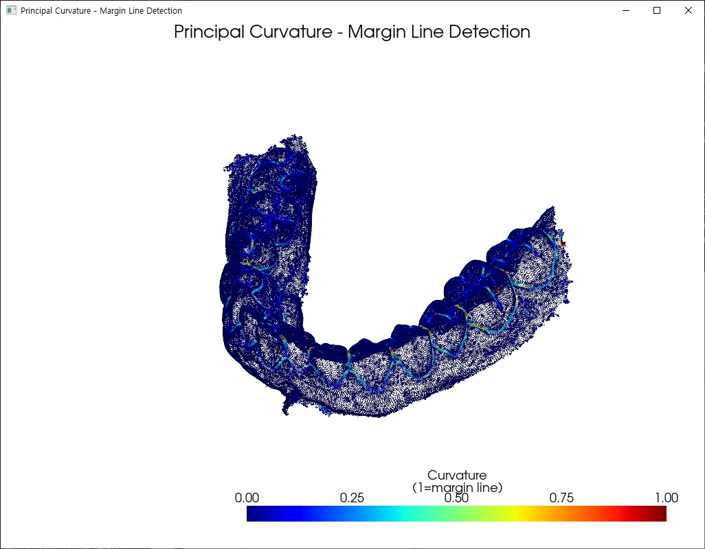

# Intraoral 3D Scan Margin Line Detection & Tooth Labeling Tool

A dental scan data pipeline that automatically detects the tooth–gum boundary (margin line) on intraoral 3D scan meshes using principal-curvature analysis, paired with a custom Unity editor tool that lets operators label each tooth by FDI number in a few clicks.

## Overview

Preparing intraoral scans for downstream dental CAD work (crown design, per-tooth segmentation) normally means manually tracing the margin line and separating teeth on a dense mesh of ~100K vertices — slow, tedious, and inconsistent between operators. This project splits the problem in two:

1. **Python pipeline** — converts STL scans into point data, computes per-vertex concave curvature, and filters out occlusal-surface and isolated noise so that only the margin line and interproximal edges remain. Results are exported in Unity-ready formats (PLY, GLB, JSON, CSV).
2. **Unity labeling tool** — loads the curvature data as a heatmap and uses it as a natural "barrier": clicking a tooth runs a BFS flood fill that stops at the margin line, assigning the whole tooth its FDI label at once. Labels are exported for the next stage (per-tooth mesh separation).

**Business value:** margin line candidates for a full-arch scan are computed in about half a second, and tooth labeling becomes a click-per-tooth task instead of manual vertex selection, producing consistent, machine-readable labels for downstream automation.

## Preview

## Key Features & Problem Solving

- **Curvature-Based Margin Line Detection** — per-vertex k-NN covariance eigen-decomposition (surface variation) with concave/convex classification; fully vectorized, processing ~94K vertices in ~0.5 s.
- **Multi-Stage Noise Filtering** — suppresses occlusal (chewing) surfaces using a combined Z-height *and* upward-normal condition, keeps only the top 10% strongest edges, and removes isolated noise via KDTree density checks. Switching the occlusal test to an AND condition recovered 1,117 interproximal edge vertices that the earlier version wrongly discarded.
- **Unity Export Pipeline** — PLY/GLB/JSON/CSV output with jet-colormap vertex colors and optional Z-up → Unity Y-up coordinate conversion.
- **Flood-Fill Tooth Labeling** — click a tooth to fill it up to the curvature barrier, with an adjustable threshold, max fill radius, and a generation-counter visited set for O(1) resets between fills.
- **Manual Barrier Painting** — brush red barrier lines across tight interproximal contacts where curvature alone cannot separate adjacent teeth.
- **Operator-Friendly Editor** — FDI color palette and 3D number overlays, curvature statistics (P50/P90 quick-set thresholds), delta-based Undo/Redo (50 steps), session save/load, and label export in JSON/CSV.

## Tech Stack

- Python (NumPy, SciPy, trimesh, PyVista, Matplotlib)
- Unity 6 (C#, Editor Window, URP custom shader)
- 3D geometry processing (curvature analysis, KDTree, mesh adjacency / BFS)

## Role

Main Programmer.
