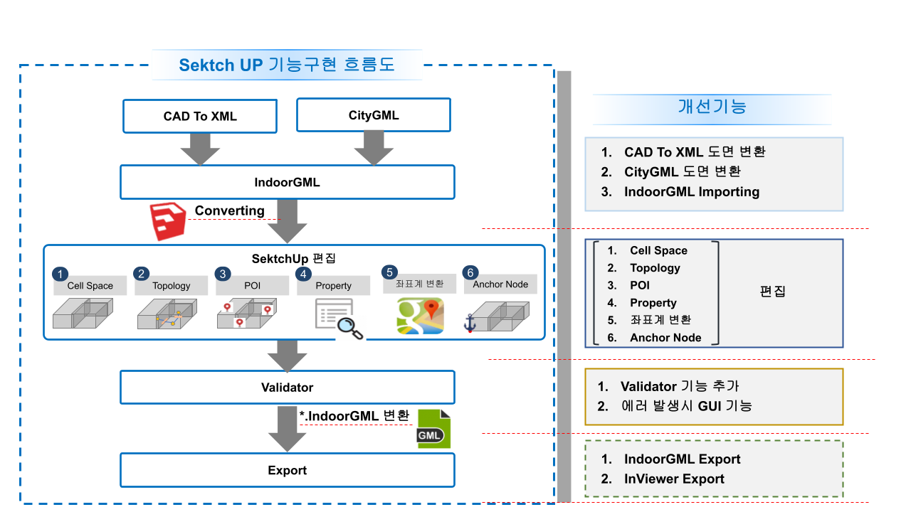
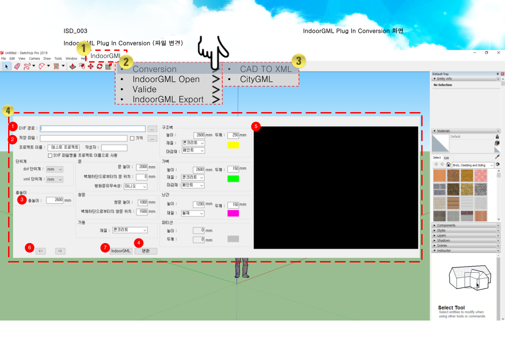
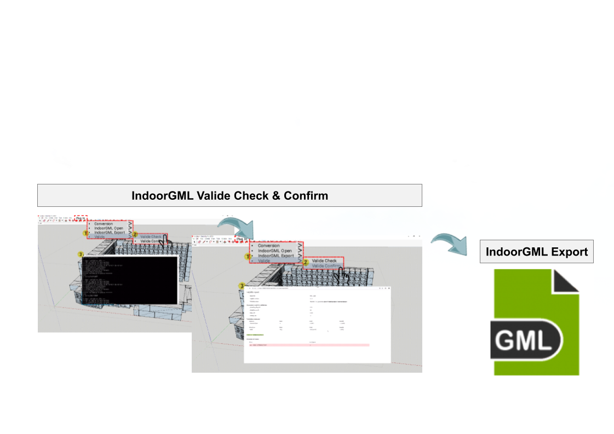

# SketchUp 공간 데이터 파이프라인 & IndoorGML 모델러

CAD/CityGML 데이터를 IndoorGML로 변환하는 SketchUp Ruby 플러그인으로, 단일한 검증 파이프라인을 통해 데스크톱 CAD 모델링과 웹 기반 실내 공간 시스템을 연결합니다.

## 개요

IndoorGML은 실내 공간 데이터에 대한 OGC 표준이지만, 이를 저작하고 검증하려면 통상적으로 건축/CAD 데이터가 실제로 모델링되는 방식과 동떨어진 전문 GIS 툴이 필요했습니다. 이 플러그인은 전체 파이프라인을 SketchUp 내부에 직접 구축합니다. CAD(DXF) 및 CityGML 원본 데이터를 가져오고, 모든 IndoorGML 공간 요소를 편집할 수 있는 커스텀 GUI를 제공하며, 결과물의 데이터 무결성을 검증한 뒤, 표준을 준수하는 `*.IndoorGML` 및 InViewer 파일을 웹에서 바로 활용 가능한 형태로 내보냅니다.

**비즈니스 가치:** CAD 저작과 실내 GIS 표준 사이의 단절 해소, 내장 검증 기능을 통한 내보내기 이전 데이터 무결성 오류 사전 발견, 익숙한 CAD 환경을 벗어나지 않고도 웹에서 바로 사용 가능한 실내 공간 데이터 생성.

## 미리보기

*엔드투엔드 파이프라인: CAD/CityGML 원본 데이터 → IndoorGML 변환 → SketchUp 내 편집(셀 공간, 토폴로지, POI, 속성, 좌표계, 앵커 노드) → 검증기 → IndoorGML/InViewer 내보내기.*

## 미디어 갤러리

| 가져오기 & 변환 GUI | 검증 워크플로 |
|---|---|
|  |  |
| DXF/CityGML 원본 데이터를 가져오고 벽체, 문, 창, 재료 파라미터를 설정하는 커스텀 변환 GUI. | 변환된 데이터의 무결성을 확인하는 내장 검증기로, 전용 GUI를 통해 오류를 표시하고 최종 IndoorGML 내보내기 전 확인 절차를 거칩니다. |

## 주요 기능 및 문제 해결

- **CAD-IndoorGML 변환 파이프라인** — CAD(DXF) 및 CityGML 원본 데이터를 모두 가져와 SketchUp 내부에서 바로 IndoorGML 공간 데이터 모델로 변환합니다.
- **커스텀 공간 편집 GUI** — SketchUp 환경을 벗어나지 않고도 셀 공간, 토폴로지, POI, 속성, 좌표계, 앵커 노드를 생성·편집할 수 있는 전용 도구.
- **내장 데이터 검증기** — 변환된 공간 데이터의 구조적·위상적 무결성을 검증하며, 오류 처리 GUI를 통해 내보내기 전 사용자가 문제를 수정하도록 안내합니다.
- **표준 준수 내보내기** — 검증된 데이터를 `*.IndoorGML` 및 InViewer 형식으로 내보내, 웹 기반 실내 공간 시스템에서 바로 활용할 수 있습니다.
- **CAD-웹 연결 다리** — 익숙한 데스크톱 CAD 모델링 워크플로와 후속 웹 기반 공간/GIS 플랫폼을 원활하게 연결합니다.

## 기술 스택

- SketchUp
- Ruby
- 플러그인 개발
- .NET Framework

## 역할

리드 개발자 — 전체 기술 아키텍처 설계와 소프트웨어 개발을 담당.
