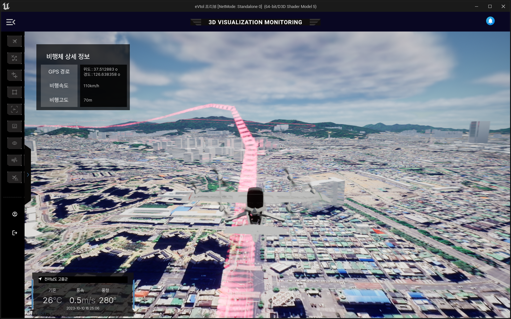

# Cesium·Unreal Engine 기반 VTOL 비행 정보 시각화 및 위험 요소 모니터링 시스템

Unreal Engine과 Cesium for Unreal을 활용해 대한민국 전역의 실제 3D 지도 위에 VTOL(수직 이착륙) 비행체의 비행 정보를 시각화하고, 비행 중 잠재적인 위험 요소를 분석하여 표시하는 3D 모니터링 시스템입니다.

## 개요

도심 상공에서 eVTOL / UAM 비행체를 운용하려면, 비행체가 지금 어디에 있고 어떤 경로로 이동해 왔으며 주변의 어떤 조건이 비행을 위험하게 만들 수 있는지를 운영자가 파악해야 합니다. 하지만 이러한 정보는 2D 지도나 원시 텔레메트리 표만으로는 직관적으로 읽기 어렵습니다. 이 프로젝트는 이 정보를 하나의 3D 화면으로 통합합니다.

1. **지리공간 3D 씬** — Cesium for Unreal로 대한민국 전역의 지리 좌표 기반 실사 3D 지형과 건물을 스트리밍하여, 비행체가 실제로 지나가는 도시와 산지 환경 위에 비행을 표시합니다.
2. **비행 시각화** — 각 비행체를 실제 GPS 위치와 고도에 배치하고, 비행 경로를 3D 궤적 리본으로 렌더링하며, 비행 상세 정보를 오버레이 패널로 보여줍니다.
3. **위험 요소 분석 및 표시** — 비행 주변의 잠재적 위험 요소(주변 지형·구조물, 기상 조건 등)를 분석하여 모니터링 UI를 통해 운영자에게 제공합니다.

**비즈니스 가치:** 운영자는 전국의 VTOL 운항 상황을 실제 지형 기반 3D 화면으로 직관적으로 파악할 수 있으며, 여러 데이터 소스를 따로 조합하지 않고도 비행을 모니터링하고 위험 상황을 조기에 발견할 수 있습니다.

## 미리보기

## 주요 기능

- **전국 단위 3D 지도** — Cesium for Unreal과 지리 좌표 기반 실사 3D 타일로 대한민국 전역의 실제 지형과 건물 위에 비행을 배치합니다.
- **GPS 기반 비행 렌더링** — 위도 / 경도 / 고도를 Unreal 월드 좌표로 변환하여 비행체 모델을 실제 위치에 비행시킵니다.
- **3D 비행 경로 궤적** — 비행 경로를 3D 공간의 반투명 리본으로 렌더링하여, 주변 도시 대비 고도 변화와 선회를 한눈에 볼 수 있습니다.
- **비행체 상세 정보 패널** — 선택한 비행체의 GPS 좌표, 비행 속도, 비행 고도를 표시합니다.
- **기상 정보 패널** — 위치, 기온, 풍속, 풍향, 시각을 비행 조건 정보로 함께 표시합니다.
- **위험 요소 분석** — 비행 중 잠재적 위험 요소를 분석하여 모니터링 화면에 표시하고, 운영자에게 알림을 제공합니다.
- **모니터링 UI** — "3D Visualization Monitoring" 전용 레이아웃과 비행·경로·영역·시점 기능을 전환하는 도구 사이드바를 제공합니다.

## 기술 스택

- Unreal Engine
- UnrealScript
- GIS (Cesium for Unreal, 3D Tiles, WGS84 GPS 좌표 → 엔진 월드 좌표 변환)

## 역할

메인 프로그래머.
