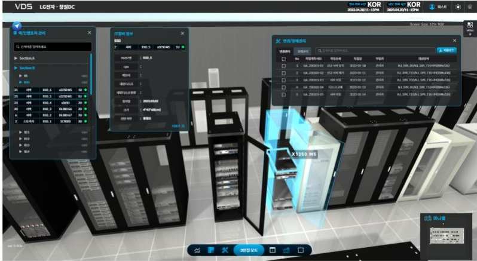

# 웹 기반 3D 데이터센터 인프라 관리(DCIM) 디지털 트윈

웹 기반 데이터센터 인프라 관리(DCIM) 플랫폼의 핵심 3D 시각화 및 프론트엔드 애플리케이션으로, 운영자가 브라우저에서 바로 서버 랙과 IT 자산을 인터랙티브 디지털 트윈 형태로 모니터링, 관리, 추적할 수 있게 합니다.

## 개요

이 플랫폼은 데이터센터 운영자에게 별도의 네이티브 클라이언트 없이 어떤 웹 브라우저에서든 접근 가능한, 완전히 인터랙티브한 물리 인프라의 3D 디지털 트윈을 제공합니다. 저의 담당 영역은 3D 환경 자체의 기술적 구현과, 3D WebGL 캔버스와 2D 웹 UI 레이어 간의 실시간 양방향 동기화였습니다(UI/UX 디자인은 디자인 팀에서 별도로 제공).

**비즈니스 가치:** 브라우저를 벗어나지 않고도 랙 및 IT 자산 상태를 직관적으로 실시간 확인, 인프라 변경 사항의 더 빠른 식별과 추적, 운영자 교육 시간을 줄여주는 통합된 3D/2D 인터페이스.

## 미리보기

*실시간 자산 상세 패널, IT 자산 정보, 변경/배포 이력을 갖춘 인터랙티브 3D 랙 뷰 — 모두 2D UI와 실시간으로 동기화됩니다.*

## 주요 기능 및 문제 해결

- **실시간 3D 디지털 트윈** — Three.js/WebGL로 구현된, 완전히 인터랙티브한 브라우저 기반 물리 서버 랙 및 IT 자산 표현.
- **3D ↔ 2D UI 동기화** — WebGL 3D 캔버스와 React 기반 2D UI 간의 양방향 실시간 동기화로, 선택, 필터, 업데이트가 두 화면에서 항상 일관되게 유지됩니다.
- **인터랙티브 자산 확인** — 3D 씬에서 랙이나 자산을 클릭하면 모델, 사양, 위치, 상태 등 상세 IT 자산 정보가 상황에 맞는 패널로 표시됩니다.
- **변경 및 배포 추적** — 시각화된 자산과 직접 연결된 변경/배포 이력(작업 유형, 날짜, 상태, 내용)을 보여주는 전용 패널.
- **섹션 및 랙 탐색** — 구조화된 섹션/랙 트리를 통해 운영자가 대규모 시설 내에서 특정 랙을 빠르게 찾고 들어갈 수 있습니다.
- **API 연동 실시간 데이터** — 3D 환경이 API 연동을 통한 실시간 백엔드 데이터로 구동되어, 디지털 트윈이 실제 인프라 상태와 동기화된 상태를 유지합니다.

## 기술 스택

- Three.js
- React
- WebGL
- 프론트엔드 개발
- API 연동

## 역할

3D 웹 & 프론트엔드 개발자.
